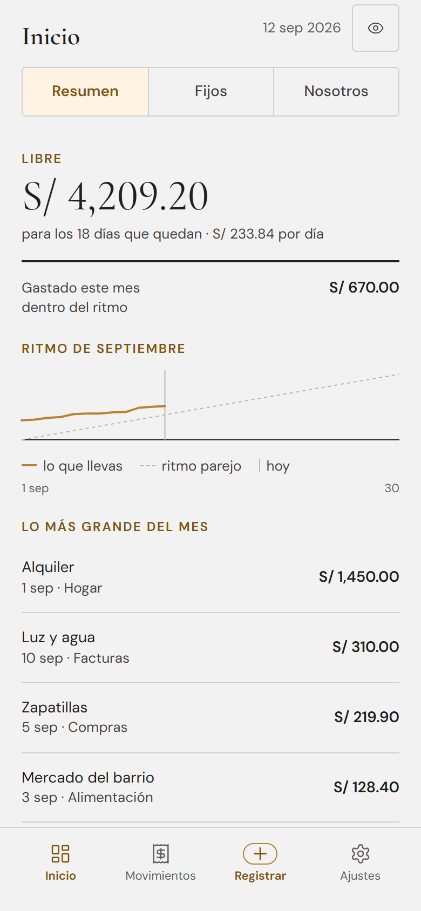
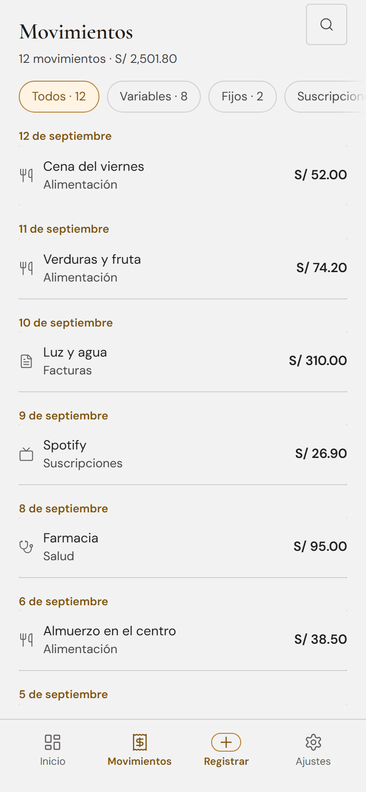
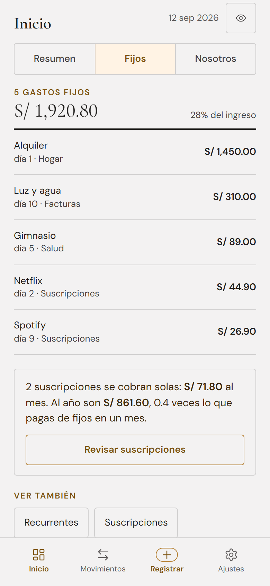

<div align="center">

# Juntos+1

**Una PWA de finanzas para parejas.** En español. Las cuentas se llevan en la
moneda que elijas al empezar, entre soles, dólares y euros, y lo que registre
cada uno queda atribuido a quien lo pagó.

[](LICENSE)
[](https://react.dev)
[](https://www.typescriptlang.org)
[](https://vite.dev)
[](https://vite-pwa-org.netlify.app)

**[Instancia en vivo](https://juntos.d3fend.me/)** · requiere cuenta para entrar

No pretende reemplazar al banco. Pretende responder dos preguntas que el banco
no responde: **cuánto nos queda de verdad este mes** y **quién pagó qué**.





<sub>Capturas con datos de ejemplo.</sub>

</div>

> [!NOTE]
> Proyecto personal, publicado por si le sirve a alguien más. Está hecho para
> el caso de uso de una pareja concreta y se nota: la interfaz está solo en
> español, los bancos que trae de fábrica son peruanos y la tarjeta de crédito
> razona con TEA y cuotas. Añadir un banco es implementar dos funciones; el
> resto de la aplicación no depende de eso.

---

## Qué hace

| Sección | Para qué sirve |
|---|---|
| **Inicio** | Una cifra grande, lo que queda libre este mes, y debajo el ritmo de gasto contra el que se puede sostener. El gráfico compara tu acumulado con la diagonal de gastar parejo, con una marca en el día de hoy. |
| **Movimientos** | La lista completa, agrupada por día, con búsqueda, filtros por tipo (variable, fijo, suscripción) y edición o borrado deslizando. |
| **Recurrentes y suscripciones** | Detecta cargos que se repiten a partir de tus movimientos, avisa cuando cambia el precio, cuando falta un cobro y cuando hay duplicados. Pausa un recurrente automáticamente si registras el pago antes de tiempo, y lo reanuda solo al llegar la fecha. |
| **Nosotros** | Reparto por persona de lo que ya está asignado, y una cola de movimientos sin autor para asignarlos rápido. |
| **Tarjeta de crédito** | Utilización, fecha límite, ciclo, TEA, simulador de pago, estrategia de cuotas y proyección al cierre. Lee el PDF del estado de cuenta del BCP en el navegador, sin subirlo a ningún sitio. |
| **Importar del banco** | Un registro de parsers, no un formato único. Cada banco implementa `detect` y `parse`, y el archivo se enruta solo al que lo reconoce. Vienen cuatro: BCP/Yape, Interbank, BBVA y Scotiabank. Lo que no encaja queda registrado con sus cabeceras para poder añadirlo. |
| **Hogares** | Los datos pertenecen a un hogar, no a una cuenta: sus dos personas ven exactamente lo mismo. Quien llega nuevo estrena el suyo, vacío, elige la moneda en la que lleva las cuentas, y para compartirlo llama a la otra persona por su correo. Al aceptar, lo que cada quien había apuntado por separado se une. |

**Además:** presupuestos, metas de ahorro, patrimonio neto, recap anual,
notificaciones push con un resumen diario y tipo de cambio en vivo.

---

## Dónde viven tus datos

Conviene ser explícito, porque son datos financieros.

| | |
|---|---|
| **Almacenamiento** | Un archivo JSON por hogar en tu propio servidor, bajo la ruta que indique `DATA_DIR`. Sin base de datos ni servicio de terceros. Un hogar nunca lee el archivo de otro: se resuelve desde la identidad de quien pregunta, no desde lo que pida. |
| **Acceso** | Microsoft Entra ID o Google, a elección de quien entra. El token de Entra se valida contra las claves públicas de tu tenant; con Google el intercambio lo hace tu servidor y emite su propia sesión firmada. |
| **PDF del banco** | Se parsean en el navegador con pdf.js. El archivo no se sube a ningún sitio. |
| **Llamadas externas** | Entra ID y, si lo activas, Google para el login; Microsoft Graph si usas la sincronización de correo; y un proveedor de tipo de cambio. |

> [!IMPORTANT]
> Si despliegas esto, el servidor es tuyo y los datos también. La
> responsabilidad de respaldarlos, igual. Apunta `DATA_DIR` a un volumen
> persistente, fuera del directorio de la aplicación, o el siguiente
> despliegue se lleva por delante el archivo.

---

## Arrancarlo en local

Necesitas Node 20+ y un registro de aplicación en Microsoft Entra ID.

```bash
git clone https://github.com/jcastanedacano/juntos-plus.git
cd juntos-plus
npm install
cp .env.example .env
```

Edita `.env` con los identificadores de tu aplicación de Entra ID. Los cuatro
valores de Azure son obligatorios: sin ellos ni el servidor ni el frontend
arrancan, a propósito.

La entrada con Google es opcional. Con `GOOGLE_CLIENT_ID`, `GOOGLE_CLIENT_SECRET`
y `SESSION_SECRET` puestas, el servidor la habilita y `VITE_GOOGLE_ACTIVO=true`
pinta el botón. Sin ellas la aplicación funciona igual, solo con Entra. El URI
de redirección que hay que registrar en Google Cloud es
`https://TU-DOMINIO/auth/google/callback`.

`MIEMBROS_PRINCIPAL` nombra, por correo o por identificador, a quién pertenecen
los datos que ya existían antes del reparto por hogares. Sin esa lista nadie los
hereda, ni siquiera sus dueños: falla cerrada a propósito, porque la
alternativa es que los reclame quien llegue primero.

```bash
npm run dev     # frontend en http://localhost:3008
npm start       # API en http://localhost:3007
```

Otros comandos:

```bash
npm run build   # comprueba tipos y compila a dist/
npm test        # tests unitarios
npm run lint
```

### Stack

React 18 · TypeScript · Vite · PWA con Workbox · Express · Recharts · MSAL
(Microsoft Entra ID) · OAuth de Google con sesión propia · date-fns · Vitest.

Sin base de datos: un archivo JSON y un candado de escritura.

<details>
<summary><b>Añadir tu banco</b></summary>

<br />

Los parsers viven en `src/data/bankParsers.ts` y el registro los prueba en
orden hasta que uno reconoce el archivo. Un banco son dos funciones:

```ts
{
  bankName: 'Tu Banco',
  version: '1.0',
  // ¿Es mío este archivo? Se decide por las cabeceras, no por el nombre.
  detect: (headers) => headers.includes('Fecha') && headers.includes('Importe'),
  parse: (headers, rows) => rows.map(fila => ({ /* ... */ })),
}
```

Lo que no reconoce ningún parser no se pierde en silencio: queda registrado con
sus cabeceras y el número de filas, para que sepas exactamente qué te falta
soportar.

De fábrica vienen BCP/Yape, Interbank, BBVA y Scotiabank, que son los que usa
la pareja para la que se hizo esto.

</details>

<details>
<summary><b>El registro en Entra ID</b></summary>

<br />

En el portal de Azure, **Entra ID → Registros de aplicaciones → Nueva**:

1. Tipo de cuenta: la que uses (una sola organización sirve).
2. Plataforma **SPA**, con URI de redirección `http://localhost:3008` para
   desarrollo y tu dominio para producción.
3. Copia el **Id. de aplicación** y el **Id. de directorio** a `.env`.

</details>

---

## Desplegarlo

<details>
<summary><b>GitHub Actions a Azure App Service</b></summary>

<br />

Hay un workflow de GitHub Actions que despliega a Azure App Service en cada
push a `main`: compila en el runner, arma un paquete solo con lo necesario
para ejecutar, sube por zip deploy y no da el despliegue por bueno hasta que
`/healthz` responde 200.

Compila en el runner porque el plan Basic (1.75 GB) se queda sin memoria
compilando Vite en el propio App Service, y la caída se manifiesta como un
reinicio silencioso del contenedor.

Para usarlo necesitas credenciales federadas (OIDC) y estas variables de
repositorio:

| Variable | Para qué |
|---|---|
| `AZURE_CLIENT_ID`, `AZURE_TENANT_ID`, `AZURE_SUBSCRIPTION_ID` | Login OIDC |
| `AZURE_RESOURCE_GROUP`, `AZURE_WEBAPP_NAME` | Dónde desplegar |
| `APP_URL` | URL pública, para la comprobación de salud |

Y en la configuración de la App Service, las mismas variables de `.env.example`.

</details>

<details>
<summary><b>Saber qué versión está desplegada</b></summary>

<br />

Cada build se sella con el SHA del commit. Un service worker sirve el HTML
desde su caché, así que el primer refresco tras un despliegue todavía muestra
la versión anterior; el sello permite notarlo:

```bash
curl -s https://tu-dominio.example/healthz
# {"status":"ok", …, "build":"054bddb","builtAt":"…"}
```

El mismo valor está en `<meta name="build">` del HTML servido.

</details>

<details>
<summary><b>Notificaciones push (opcional)</b></summary>

<br />

```bash
npx web-push generate-vapid-keys
```

Pon el par de claves y un `VAPID_SUBJECT` con un correo real en el entorno.
Si falta cualquiera de los tres, los endpoints de push responden 503 y el
resto del servidor funciona igual.

</details>

---

## Licencia

MIT. Ver [LICENSE](LICENSE).

---

<div align="center">

### 👤 Autor

**Jorge Castañeda**

[LinkedIn](https://www.linkedin.com/in/jcastanedacano) · [GitHub](https://github.com/jcastanedacano)

</div>
